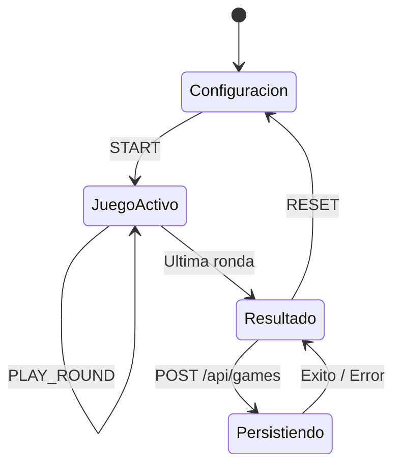
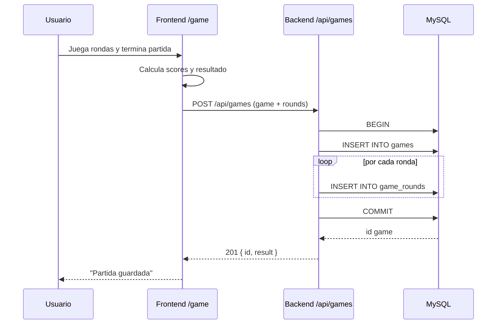
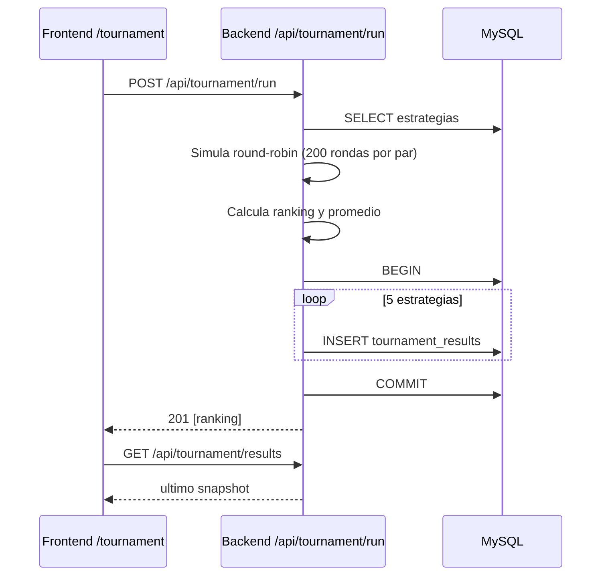
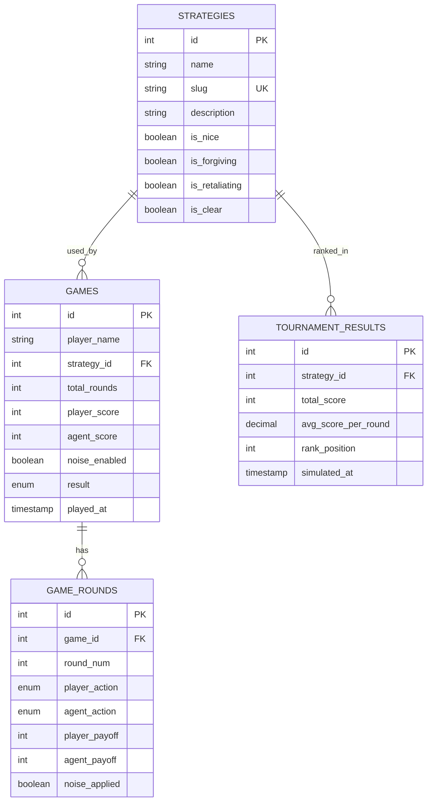
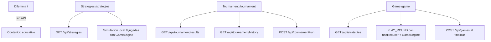

# Game Theory App

Aplicacion educativa sobre Teoria de Juegos enfocada en el Dilema del Prisionero.

Incluye:

- 4 vistas en frontend: Dilema, Estrategias, Torneo, Juego
- API REST en Express con persistencia en MySQL
- Motor de decisiones puro en JavaScript para los agentes
- Simulaciones round-robin tipo Axelrod
- Guardado de partidas y detalle ronda por ronda
- Modulo multijugador aislado en tiempo real (Socket.IO) ejecutado en puertos separados

## Stack

- Frontend: React + Vite + React Router DOM + Recharts + Axios + CSS Modules
- Backend: Express + mysql2 (pool + prepared statements)
- Base de datos: MySQL 8 en Docker Compose

## Requisitos

- Node.js >= 18
- npm >= 9
- Docker Desktop activo

## Arranque rapido

Desde la raiz del proyecto:

```powershell
npm run db:up
npm run dev
```

## URLs de desarrollo

- Frontend: http://localhost:5173
- Backend: http://localhost:3001
- Health: http://localhost:3001/api/health
- Multiplayer Frontend (separado): http://localhost:5174
- Multiplayer Backend (separado): http://localhost:3002
- Multiplayer Health: http://localhost:3002/health

## Scripts

```powershell
npm run db:up
npm run db:down
npm run db:logs
npm run backend
npm run frontend
npm run dev
npm run build
npm run mp:backend
npm run mp:frontend
npm run mp:dev
npm run mp:build
```

## Modulo multijugador separado

Para no afectar el sistema existente, el modo multijugador corre como dos apps nuevas e independientes:

- `multiplayer-backend/` (Express + Socket.IO, puerto `3002`)
- `multiplayer-frontend/` (React + Vite, puerto `5174`)

Ejecucion:

```powershell
npm --prefix multiplayer-backend install
npm --prefix multiplayer-frontend install
npm run mp:dev
```

La app original (`npm run dev`) permanece intacta y no depende del modulo multijugador.

### Acceso desde otros dispositivos (multijugador)

1. Levantar multijugador:

```powershell
npm run mp:dev
```

2. Obtener IP local del host (Windows):

```powershell
ipconfig
```

3. Abrir desde otro dispositivo en la misma red:

- Frontend multiplayer: `http://TU_IP_LOCAL:5174`

Notas:

- El frontend multiplayer ya se levanta con `--host 0.0.0.0`.
- Si restringes CORS en backend multiplayer, define `MP_ALLOWED_ORIGINS`.

### Exponer por internet con ngrok (opcional)

Necesitas dos tuneles (frontend y backend):

```powershell
ngrok http 5174
ngrok http 3002
```

Luego configura en `multiplayer-frontend/.env`:

```env
VITE_MP_API_URL=https://TU_BACKEND_NGROK
VITE_MP_WS_URL=https://TU_BACKEND_NGROK
```

Y en `multiplayer-backend/.env`:

```env
MP_ALLOWED_ORIGINS=https://TU_FRONTEND_NGROK
```

Reinicia `npm run mp:dev` despues de cambiar env vars.

### Exponer multijugador con Cloudflare (recomendado)

Para evitar problemas de CORS y sockets entre dominios, usa modo URL unica:

1. Build del frontend multiplayer:

```powershell
npm run mp:build
```

2. Levantar backend multiplayer sirviendo frontend + API + Socket.IO en un solo puerto:

```powershell
Set-Location multiplayer-backend
$env:MP_PORT="3102"
$env:MP_SERVE_STATIC="true"
$env:MP_ALLOWED_ORIGINS="*"
npm start
```

3. Publicar ese puerto con Cloudflare Tunnel:

```powershell
cloudflared tunnel --url http://localhost:3102 --no-autoupdate
```

Comparte la URL `https://...trycloudflare.com` y los usuarios podran jugar multijugador desde internet.

## Estructura del proyecto

```text
game-theory-app/
├── backend/                  # API Express
├── frontend/                 # SPA React
├── db/                       # Schema + seed SQL
├── docs/                     # Documentacion completa
├── docker-compose.yml        # MySQL aislado
└── package.json              # Scripts raiz
```

## Documentacion completa

Indice principal:

- [docs/README.md](docs/README.md)

Documentos detallados:

- [docs/01-arquitectura-general.md](docs/01-arquitectura-general.md)
- [docs/02-backend.md](docs/02-backend.md)
- [docs/03-frontend.md](docs/03-frontend.md)
- [docs/04-base-de-datos.md](docs/04-base-de-datos.md)
- [docs/05-api-reference.md](docs/05-api-reference.md)

## Diagramas Mermaid

### 1) Arquitectura general

```mermaid
flowchart LR
	U[Usuario] --> F[Frontend React]
	F -->|Axios HTTP| B[Backend Express]
	B -->|mysql2 pool.execute| DB[(MySQL 8)]
	DB --> V[(Volumen Docker)]

	subgraph Frontend
	  R1[/]
	  R2[/strategies]
	  R3[/tournament]
	  R4[/game]
	  GE[GameEngine.js]
	  GS[useGameState.js]
	end

	F --- R1
	F --- R2
	F --- R3
	F --- R4
	R2 -. simulacion local .-> GE
	R4 --> GS
	R4 --> GE

	subgraph Backend
	  S1[/api/strategies]
	  S2[/api/games]
	  S3[/api/tournament]
	  S4[/api/health]
	end

	B --- S1
	B --- S2
	B --- S3
	B --- S4
```

### 2) Flujo de partida interactiva



### 3) Secuencia de guardado de partida



### 4) Secuencia de torneo



### 5) Modelo de datos (ER)



### 6) Flujo de peticiones por vista



## Contenedor de BD aislado

- Nombre: game_theory_db_edu
- Puerto host: 3317
- Puerto interno MySQL: 3306
- Archivo de inicializacion: [db/init.sql](db/init.sql)

## Verificacion recomendada

```powershell
Invoke-RestMethod http://localhost:3001/api/health
Invoke-RestMethod http://localhost:3001/api/strategies
```

Si la API responde y el frontend abre en 5173, el flujo completo esta operativo.
