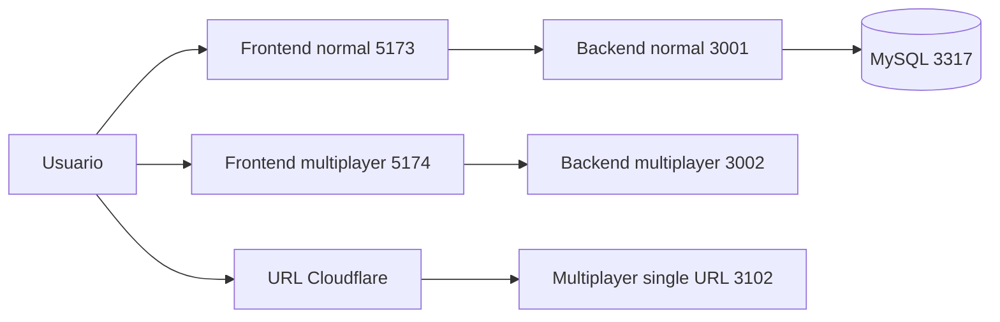
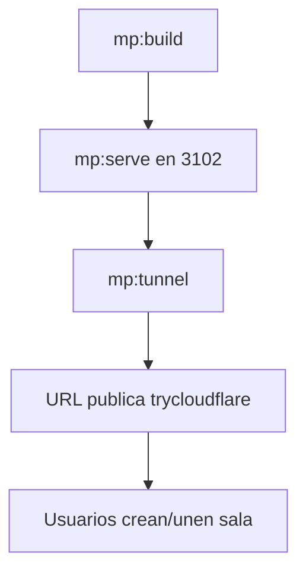

# Game Theory App

Aplicacion educativa de Teoria de Juegos con dos modos de uso:

1. Modo normal (humano vs agente, persistencia en MySQL).
2. Modo multijugador en tiempo real (Socket.IO), aislado del modo normal.

## Inicio rapido (2 minutos)

### Opcion A - Proyecto normal

```powershell
npm run db:up
npm run dev
```

URLs:

1. Frontend normal: http://localhost:5173
2. Backend normal: http://localhost:3001
3. Health normal: http://localhost:3001/api/health

### Opcion B - Multijugador local

```powershell
npm run mp:dev
```

URLs:

1. Frontend multiplayer: http://localhost:5174
2. Backend multiplayer: http://localhost:3002
3. Health multiplayer: http://localhost:3002/health

### Opcion C - Multijugador publico con Cloudflare (recomendado)

```powershell
npm run mp:build
npm run mp:serve
npm run mp:tunnel
```

Comparte la URL `https://...trycloudflare.com` que imprime el comando `mp:tunnel`.

## Scripts principales

```powershell
npm run db:up
npm run db:down
npm run dev
npm run build

npm run mp:dev
npm run mp:build
npm run mp:serve
npm run mp:tunnel
```

## Arquitectura resumida



## Flujo recomendado para multiplayer publico



## Estructura

```text
game-theory-app/
|- backend/
|- frontend/
|- multiplayer-backend/
|- multiplayer-frontend/
|- db/
|- docs/
`- package.json
```

## Documentacion completa

Indice general:

1. [docs/README.md](docs/README.md)

Guia rapida y operacion:

1. [docs/00-inicio-rapido.md](docs/00-inicio-rapido.md)
2. [docs/06-multijugador.md](docs/06-multijugador.md)
3. [docs/07-deploy-cloudflare.md](docs/07-deploy-cloudflare.md)

Documentacion tecnica base:

1. [docs/01-arquitectura-general.md](docs/01-arquitectura-general.md)
2. [docs/02-backend.md](docs/02-backend.md)
3. [docs/03-frontend.md](docs/03-frontend.md)
4. [docs/04-base-de-datos.md](docs/04-base-de-datos.md)
5. [docs/05-api-reference.md](docs/05-api-reference.md)
