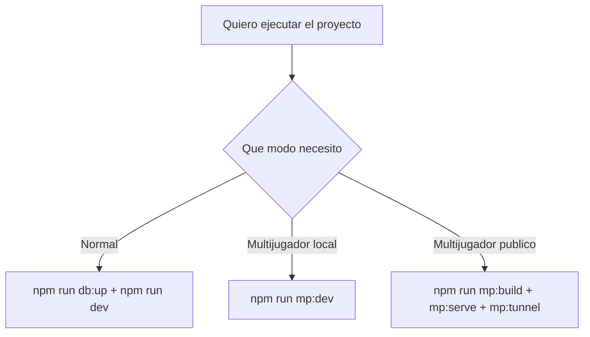

# 00 - Inicio Rapido

Guia minima para iniciar cualquiera de los modos en pocos pasos.

## Requisitos

1. Node.js 18+
2. npm 9+
3. Docker Desktop (solo para modo normal)

## Flujo de decision



## Modo normal

```powershell
npm run db:up
npm run dev
```

URLs:

1. Frontend: http://localhost:5173
2. Backend: http://localhost:3001
3. Health: http://localhost:3001/api/health

## Multijugador local

```powershell
npm run mp:dev
```

URLs:

1. Frontend: http://localhost:5174
2. Backend: http://localhost:3002
3. Health: http://localhost:3002/health

## Multijugador publico (Cloudflare)

```powershell
npm run mp:build
npm run mp:serve
npm run mp:tunnel
```

Comparte la URL `https://...trycloudflare.com` que imprime `mp:tunnel`.

## Comprobacion rapida

```powershell
Invoke-RestMethod http://localhost:3001/api/health
Invoke-RestMethod http://localhost:3002/health
Invoke-RestMethod http://localhost:3102/health
```

Nota: el puerto 3102 corresponde al modo single URL para publicar multiplayer.
