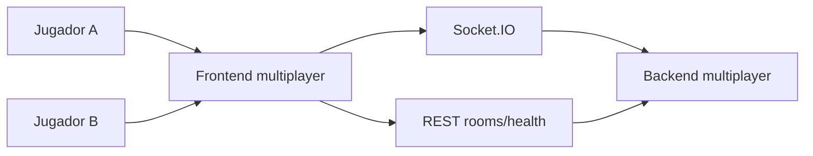
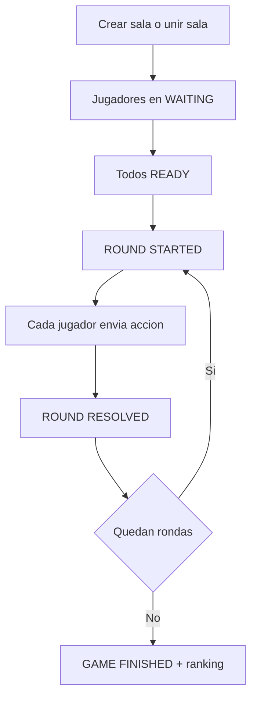

# 06 - Multijugador

Este modulo es aislado del modo normal para no romper el flujo existente.

## Componentes

1. multiplayer-frontend (React + Vite)
2. multiplayer-backend (Express + Socket.IO)

## Puertos por defecto

1. Frontend multiplayer: 5174
2. Backend multiplayer: 3002
3. Modo single URL (deploy): 3102

## Arquitectura multiplayer



## Flujo de partida



## Ejecucion local

```powershell
npm run mp:dev
```

## Ejecucion single URL

Este modo sirve frontend y backend desde el mismo puerto para facilitar despliegue publico:

```powershell
npm run mp:build
npm run mp:serve
```

En este modo, la app completa queda en:

1. http://localhost:3102
2. http://localhost:3102/health

## Variables de entorno importantes

Backend:

1. MP_PORT
2. MP_SERVE_STATIC
3. MP_ALLOWED_ORIGINS
4. MP_RECONNECT_GRACE_MS

Frontend:

1. VITE_MP_API_URL
2. VITE_MP_WS_URL

Nota: en modo single URL normalmente no hace falta definir `VITE_MP_API_URL` ni `VITE_MP_WS_URL`.
