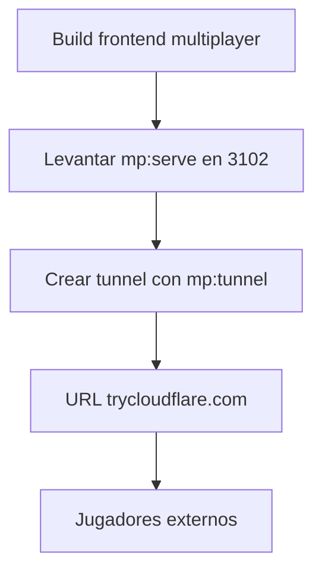

# 07 - Deploy Cloudflare (rapido)

Guia practica para publicar multiplayer en internet usando Cloudflare Tunnel.

## Objetivo

Exponer multiplayer por una sola URL publica para que usuarios externos puedan:

1. Entrar
2. Crear/unirse a sala
3. Jugar rondas en tiempo real

## Flujo recomendado



## Pasos

### 1) Build

```powershell
npm run mp:build
```

### 2) Levantar app en single URL

```powershell
npm run mp:serve
```

### 3) Exponer por internet

```powershell
npm run mp:tunnel
```

Cloudflare imprimira una URL similar a:

1. https://algo.trycloudflare.com

Comparte esa URL.

## Verificacion

1. Abrir URL desde red externa (telefono con datos moviles)
2. Crear sala desde cliente A
3. Unirse con codigo desde cliente B
4. Validar envio de acciones por ronda

## Troubleshooting rapido

### Boton de accion bloqueado

1. Actualizar cliente (hard refresh)
2. Confirmar que estas en estado IN_ROUND

### Error de puerto en 3102

El script `mp:serve` limpia el puerto automaticamente. Si hay bloqueo residual:

```powershell
Get-NetTCPConnection -State Listen -LocalPort 3102 | Select-Object -ExpandProperty OwningProcess -Unique | ForEach-Object { Stop-Process -Id $_ -Force }
```

### URL de tunnel dejo de funcionar

Los quick tunnels son temporales. Reinicia:

```powershell
npm run mp:tunnel
```

## Recomendacion para produccion

Para URL fija y mayor estabilidad, crear tunnel nombrado con cuenta Cloudflare en vez de quick tunnel.
